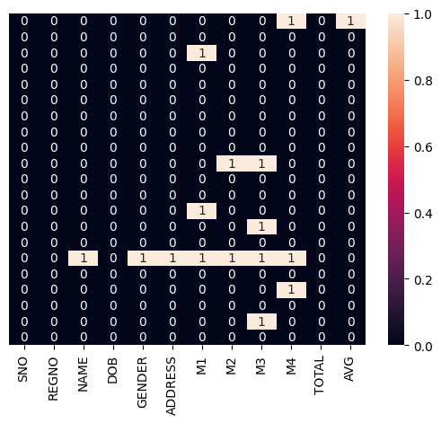

# Exno:1
Data Cleaning Process

# AIM
To read the given data and perform data cleaning and save the cleaned data to a file.

# Explanation
Data cleaning is the process of preparing data for analysis by removing or modifying data that is incorrect ,incompleted , irrelevant , duplicated or improperly formatted. Data cleaning is not simply about erasing data ,but rather finding a way to maximize datasets accuracy without necessarily deleting the information.

# Algorithm
STEP 1: Read the given Data

STEP 2: Get the information about the data

STEP 3: Remove the null values from the data

STEP 4: Save the Clean data to the file

STEP 5: Remove outliers using IQR

STEP 6: Use zscore of to remove outliers

# Coding and Output
```
import pandas as pd
df=pd.read_csv("/content/SAMPLEIDS (1).csv")
df
```

```
df.info()
```


```
df.describe()
```

```
df.shape #(rows,columns)
```

```
df.isnull()
```

```
df.notnull()
```

```
df.dropna(axis=0) #deletes the row if it has a null value
```

```
df.dropna(axis=1) #deletes the column if it has a nul value
```

```
dfs=df[df['TOTAL']>270]
dfs
```


```
dfs=df[df['NAME'].str.startswith(('A','C'))&(df['TOTAL']>250)]
dfs
```

```
df.iloc[:4]
```

```
df.iloc[0:4,1:4]
```

```
df.iloc[[1,3,5],[1,3]]
```

```
dff=df.fillna(0)
dff
```

```
df['TOTAL'].fillna(value=df['TOTAL'].mean(),inplace=True)
df
```

```
df.fillna(method='ffill')
```

```
df.fillna(method='bfill')
```


```
df['TOTAL'].fillna(value=df['TOTAL'].mean(),inplace=True)
df
```

```
import seaborn as sns
sns.heatmap(df.isnull(),yticklabels=False,annot=True)
```

```
df.dropna(inplace=True)
sns.heatmap(df.isnull(),yticklabels=False,annot=True)
```
.png>)
```
page=[1,3,28,27,25,92,30,39,40,50,26,24,29,94]
af=pd.DataFrame(age)
af
```
 
```
sns.boxplot(data=af)
```
.png>)
```
sns.scatterplot(data=af)
```
.png>)
```
q1=af.quantile(0.25)
q2=af.quantile(0.50)
q3=af.quantile(0.75)
iqr=q3-q1
iqr
```

```
import numpy as np
Q1=np.percentile(af,25)
Q3=np.percentile(af,75)
IQR=Q3-Q1
IQR
```

```
lower_bound=Q1-1.5*IQR
lower_bound
```

```
upper_bound=Q3+1.5*IQR
upper_bound
```

```
outliers=[x for x in age if x<lower_bound or x>upper_bound]
print("Q1:",Q1)
print("Q3:",Q3)
print("IQR:",IQR)
print("Lower Bound:",lower_bound)
print("Upper Bound:",upper_bound)
print("Outliers:",outliers)
```

```
af=af[((af>=lower_bound)&(af<=upper_bound))]
af
```

```
af=af.dropna()
af
```

```
sns.boxplot(data=af)
```
.png>)
```
sns.scatterplot(data=af)
```
.png>)
```
data=[1,2,2,2,3,1,1,15,2,2,2,3,1,1,2]
mean=np.mean(data)
std=np.std(data)
print('mean of the dataset is',mean)
print('std.deviation is',std)
```


```
threshold=3
outlier=[]
for i in data:
  z=(i-mean)/std
  if z>threshold:
    outlier.append(i)
print('outlier in dataset is',outlier)
```

```
from scipy import stats
data={'weight':[12,15,18,21,24,27,30,33,36,39,42,45,48,51,54,57,60,63,
66,69,202,72,75,78,81,84,232,87,90,93,96,99,258]}
wf=pd.DataFrame(data)
wf
```

```
z=np.abs(stats.zscore(wf))
print(wf[z['weight']>3])
```

# Result
          <<include your Result here>>
          